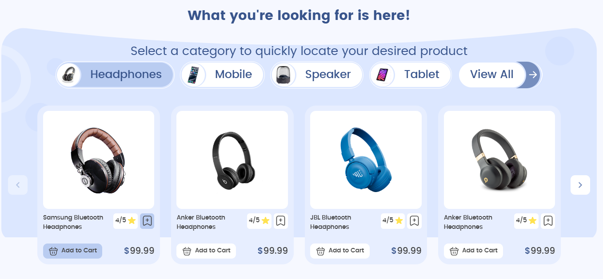
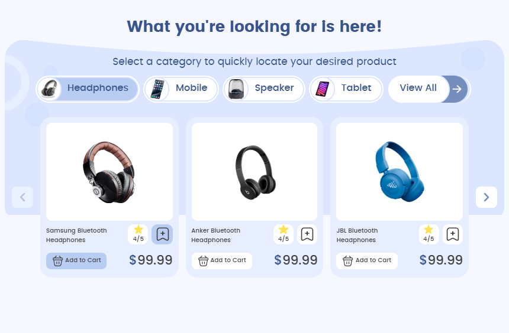

# Digital Shop Web Project  

This is a simple and dynamic digital shop project, built to practice and showcase my JavaScript skills. The project is designed as a **mini project** that will constantly evolve as I learn new concepts in JavaScript and web development.  

## Features  
- Dynamic product display using JavaScript.  
- Data managed with an array of objects (acts as a simple database).  
- Responsive design powered by **Bootstrap 5** and **Sass**.  
- Future updates will include a shopping cart and additional features.  

## Project Goals  
This project is an educational and growing endeavor to:  
1. Practice JavaScript skills in a real-world scenario.  
2. Improve dynamic web development techniques.  
3. Continuously update and enhance the project as I progress.  

## Current Structure  
- Designed with responsiveness for desktops, tablets, and mobiles.  
- **Product Section**: Developed based on this [design inspiration](https://www.instagram.com/p/DFqFoRdtf5J/?igsh=MTBiZXY5b3VydThi).  

## Current Status  
This project is currently under development. As of **9 February 2025**, I have received a relatively larger project that requires my focus for the next three months. As a result, the progress of this project might slow down.  

## Future Plans  
- Dynamically implement the **Categories Section** and **Product Section**.  
- Add a **Product Details Page**.  
- Develop a **Header** and **Footer**.  
- Enhance UI/UX based on feedback and new inspirations.  
